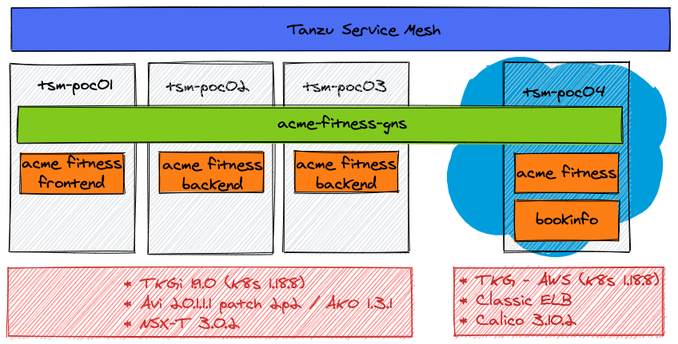

# Requirements
[Environment Requirements and Supported Platforms](https://docs.vmware.com/en/VMware-Tanzu-Service-Mesh/services/tanzu-service-mesh-environment-requirements-and-supported-platforms/GUID-D0B939BE-474E-4075-9A65-3D72B5B9F237.html)

# Setup
### Version information
**On prem (tsm-poc01, tsm-poc02)**
* TKGi 1.9.0 (K8s 1.18.8)
* Avi 20.1.1.1 patch 2p2 / AKO 1.3.1
* NSX-T 3.0.2

**TKG - AWS (tsm-poc03)**
* TKG - AWS (K8s 1.18.8)
* Classic ELB
* Calico
* 
### Environment Overview

